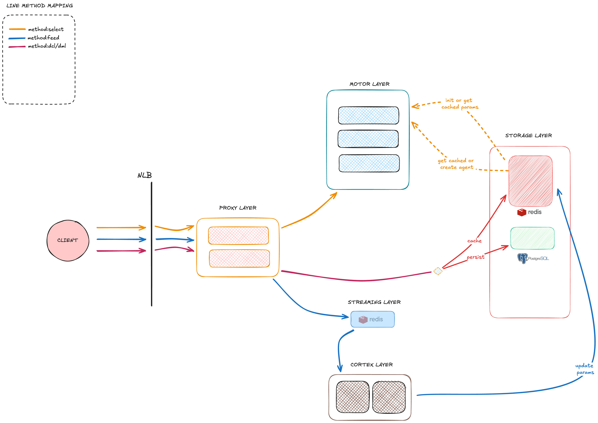

<p align="center">
  <h1 align="center">Qbrix</h1>
  <p align="center">
    <strong>Distributed Multi-Armed Bandit Optimization Platform</strong>
  </p>
  <p align="center">
    Real-time decisions. Continuous learning. Infinite scale.
  </p>
</p>

<p align="center">
  <a href="#features">Features</a> &bull;
  <a href="#architecture">Architecture</a> &bull;
  <a href="#quick-start">Quick Start</a> &bull;
  <a href="#api-reference">API Reference</a> &bull;
  <a href="#deployment">Deployment</a> &bull;
  <a href="#documentation">Documentation</a>
</p>

---

## What is Qbrix?

Qbrix is a **production-grade multi-armed bandit (MAB) platform** designed for high-throughput, low-latency decision optimization. It separates the hot path (selection) from the learning path (training) to deliver sub-millisecond decisions while continuously learning from feedback.

**Use Cases:**
- **A/B Testing** — Dynamically allocate traffic to winning variants
- **Recommendation Systems** — Personalize content in real-time
- **Ad Optimization** — Maximize CTR with contextual bandits
- **Dynamic Pricing** — Optimize prices based on demand signals
- **Feature Rollouts** — Gradual rollouts with automatic winner detection

---

## Features

| Feature | Description |
|---------|-------------|
| **Multi-Tenant Architecture** | Secure data isolation with implicit tenant resolution via authentication |
| **12+ Bandit Algorithms** | Thompson Sampling, UCB, LinUCB, EXP3, and more |
| **Contextual Bandits** | Leverage user/item features for personalized decisions |
| **Feature Gates** | Percentage-based rollouts with targeting rules |
| **Horizontal Scaling** | Stateless selection service scales to millions of requests |
| **Event Sourcing** | Reliable training with Redis Streams back-pressure |
| **Dual Protocol** | gRPC for internal services, REST API for external clients |
| **JWT & API Keys** | Flexible authentication for different use cases |

---

## Architecture

<p align="center">
  
</p>

### Services

| Service | Role | Scaling |
|---------|------|---------|
| **proxysvc** | Gateway & control plane | Horizontal |
| **motorsvc** | Hot path selection | Horizontal |
| **cortexsvc** | Batch training (event sourcing) | Single instance |

### Data Flow

```
┌─────────┐      ┌───────────┐      ┌───────────┐      ┌───────┐
│  Client │─────▶│  proxysvc │─────▶│  motorsvc │─────▶│ Redis │
└─────────┘      └───────────┘      └───────────┘      └───────┘
     │                 │                                    ▲
     │                 │ feedback                           │
     │                 ▼                                    │
     │           ┌───────────┐      ┌───────────┐          │
     │           │  Streams  │─────▶│ cortexsvc │──────────┘
     │           └───────────┘      └───────────┘
     │                                    │
     │           ┌───────────┐            │
     └──────────▶│ Postgres  │◀───────────┘
                 └───────────┘
```

**Selection Path** (hot): Client → proxysvc → motorsvc → Redis (cached params)
**Training Path** (async): Feedback → Redis Streams → cortexsvc → Redis (updated params)

---

## Quick Start

### Prerequisites

- Python 3.10+
- Docker & Docker Compose
- [uv](https://github.com/astral-sh/uv) package manager

### 1. Clone & Install

```bash
git clone https://github.com/your-org/qbrix.git
cd qbrix
make install
```

### 2. Start Infrastructure

```bash
make infra    # Postgres + Redis
make dev      # All services
```

### 3. Create Your First Experiment

```bash
# Register and get API key
curl -X POST http://localhost:8080/auth/register \
  -H "Content-Type: application/json" \
  -d '{"email": "you@example.com", "password": "secure123"}'

# Create a pool of arms
curl -X POST http://localhost:8080/api/v1/pools \
  -H "Authorization: Bearer <token>" \
  -H "Content-Type: application/json" \
  -d '{
    "name": "homepage-buttons",
    "arms": [
      {"name": "blue", "metadata": {"color": "#0066cc"}},
      {"name": "green", "metadata": {"color": "#00cc66"}},
      {"name": "red", "metadata": {"color": "#cc0000"}}
    ]
  }'

# Create an experiment
curl -X POST http://localhost:8080/api/v1/experiments \
  -H "Authorization: Bearer <token>" \
  -H "Content-Type: application/json" \
  -d '{
    "name": "button-color-test",
    "pool_id": "<pool_id>",
    "protocol": "beta_ts"
  }'
```

### 4. Get a Selection

```bash
curl -X POST http://localhost:8080/api/v1/select \
  -H "Authorization: Bearer <token>" \
  -H "Content-Type: application/json" \
  -d '{
    "experiment_id": "<experiment_id>",
    "context": {
      "user_segment": "premium",
      "device": "mobile"
    }
  }'
```

**Response:**
```json
{
  "arm": {"name": "green", "metadata": {"color": "#00cc66"}},
  "selection_token": "eyJ0bnRfaWQiOiJ...",
  "request_id": "req_abc123"
}
```

### 5. Send Feedback

```bash
curl -X POST http://localhost:8080/api/v1/feedback \
  -H "Authorization: Bearer <token>" \
  -H "Content-Type: application/json" \
  -d '{
    "selection_token": "eyJ0bnRfaWQiOiJ...",
    "reward": 1.0
  }'
```

---

## API Reference

### Authentication

| Endpoint | Method | Description |
|----------|--------|-------------|
| `/auth/register` | POST | Register new user (creates tenant) |
| `/auth/login` | POST | Get JWT access token |
| `/auth/api-keys` | POST | Create API key |

### Resources

| Endpoint | Method | Description |
|----------|--------|-------------|
| `/api/v1/pools` | GET, POST | List/create arm pools |
| `/api/v1/pools/{id}` | GET, PUT, DELETE | Manage pool |
| `/api/v1/experiments` | GET, POST | List/create experiments |
| `/api/v1/experiments/{id}` | GET, PUT, DELETE | Manage experiment |
| `/api/v1/gates` | GET, POST | List/create feature gates |

### Selection & Feedback

| Endpoint | Method | Description |
|----------|--------|-------------|
| `/api/v1/select` | POST | Get arm selection |
| `/api/v1/feedback` | POST | Submit reward feedback |

---

## Supported Algorithms

### Stochastic Bandits
| Algorithm | Best For |
|-----------|----------|
| `beta_ts` | Binary rewards (clicks, conversions) |
| `gaussian_ts` | Continuous rewards |
| `ucb1_tuned` | When you need theoretical guarantees |
| `kl_ucb` | Binary rewards with tight bounds |
| `epsilon_greedy` | Simple baseline |
| `moss` | Fixed horizon problems |

### Contextual Bandits
| Algorithm | Best For |
|-----------|----------|
| `lin_ucb` | Linear reward models with features |
| `lin_ts` | Linear models with uncertainty |

### Adversarial Bandits
| Algorithm | Best For |
|-----------|----------|
| `exp3` | Non-stationary environments |
| `fpl` | Follow the perturbed leader |

---

## Deployment

### Docker Compose (Development)

```bash
docker compose up --build
```

### Kubernetes (Production)

```bash
# Development cluster
helm install qbrix ./helm/qbrix -f helm/qbrix/values-dev.yaml

# Production with managed services
helm install qbrix ./helm/qbrix \
  --set global.postgres.host=your-postgres.example.com \
  --set global.redis.host=your-redis.example.com
```

### Scaling Guidelines

| Service | Replicas | Notes |
|---------|----------|-------|
| proxysvc | 2-10 | Scale with request volume |
| motorsvc | 3-20 | Scale with selection QPS |
| cortexsvc | 1 | Single instance (event sourcing) |

---

## Multi-Tenancy

Qbrix supports **multi-tenant deployments** with complete data isolation:

- **Implicit tenant resolution** — No `X-Tenant-ID` header required
- **1:1 user-tenant mapping** — Each user belongs to exactly one tenant
- **Automatic tenant creation** — New tenant created on user registration
- **Isolated data** — Separate pools, experiments, and parameters per tenant

See [`TENANTIDENTIFICATION.md`](TENANTIDENTIFICATION.md) for implementation details.

---

## Documentation

| Document | Description |
|----------|-------------|
| [`CLAUDE.md`](CLAUDE.md) | Developer guide & coding conventions |
| [`TENANTIDENTIFICATION.md`](TENANTIDENTIFICATION.md) | Multi-tenancy architecture |
| [`helm/README.md`](helm/README.md) | Kubernetes deployment guide |

---

## Tech Stack

| Component | Technology |
|-----------|------------|
| Language | Python 3.10+ |
| Package Manager | uv (workspace mode) |
| HTTP API | FastAPI |
| Inter-service | gRPC |
| Database | PostgreSQL |
| Cache | Redis |
| Queue | Redis Streams |
| Orchestration | Kubernetes / Helm |

---

## Development

```bash
make install      # Install dependencies
make test         # Run test suite
make lint         # Type checking (mypy)
make fmt          # Format code (black)
make proto        # Generate gRPC stubs
make dev          # Run all services locally
```

---

## License

[MIT](LICENSE)

---

<p align="center">
  Built for decisions that matter.
</p>
